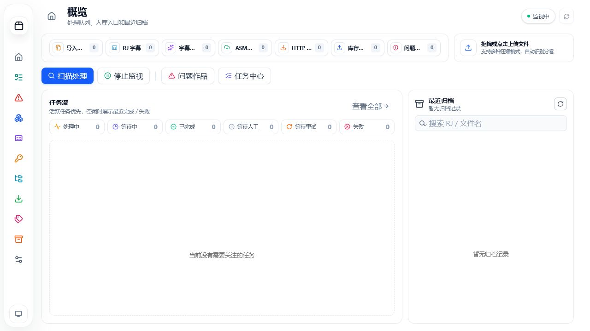
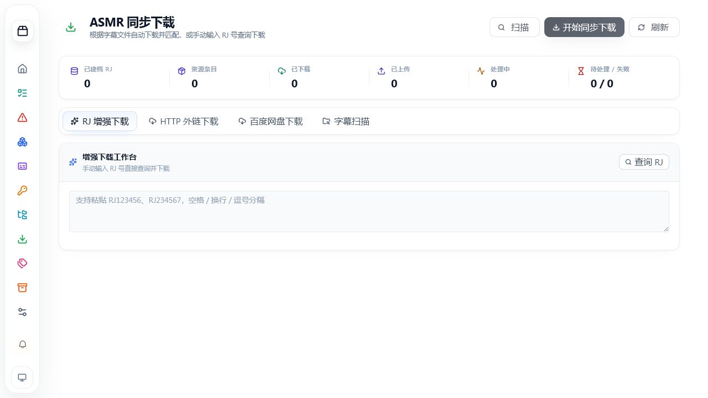

# KikoeruManager

一个面向 DLsite 同人音声库的本地 / 远程一体化工作台。它不是单纯的“解压重命名脚本”，而是把压缩包识别、自动解压、元数据抓取、库存入库、字幕配对、ASMR 补全、DLsite 特典探测、HTTP 外链下载、百度网盘转存、重复冲突处理、任务中心、操作审计和通知模板串成完整业务链路，适合长期维护本地多盘与群晖远程库存。

[](https://github.com/Elena3939/KikoeruManager/pkgs/container/kikoerumanager)
[](LICENSE)

> **重要提示**：使用本软件即表示已阅读并同意 [免责声明与使用条款](DISCLAIMER.md)。本软件仅限 18 周岁及以上成年人使用。

### 界面与工作流

KikoeruManager 以多工作台方式组织功能。概览页集中展示导入、RJ 字幕、字幕补配、ASMR 下载、HTTP 外链、库存备份和问题作品入口，并把活跃任务、等待人工、失败重试与最近归档放在同一视图中。



ASMR 同步工作台把 RJ 增强下载、HTTP 外链下载、百度网盘下载和字幕目录扫描放在同一页面；资源发现、文件选择、下载进度、失败重试和最终入库共用统一任务语义。



### 已实现业务能力

#### 压缩包处理与入库

- **智能识别压缩包**：支持 ZIP / RAR / 7z / tar / gz、分卷压缩包、错误后缀修复、非压缩后缀伪装包识别，以及“MP4 / 垃圾前缀 + ZIP payload”这类带前缀伪装 ZIP。
- **自动解压链路**：支持密码字典自动尝试、嵌套压缩包递归处理、单层包装目录折叠、Linux 超长顶层目录重映射解压、解压失败问题作品落库、临时文件清理和任务取消回收。
- **过滤文件可恢复**：命中过滤规则的文件和目录进入任务恢复区，可从任务中心按文件或目录还原；跨盘恢复使用流式复制，不覆盖库存中的同名内容。
- **DLsite 元数据抓取**：自动补齐 RJ 标题、社团、CV、标签、封面、系列、关联作品，以及原版、翻译版、多语言版本关系。
- **自动分类入库**：按社团、系列、RJ 段等规则整理目录，支持本地多库存和群晖远程库存并存。
- **重复与冲突处理**：重复作品、关联版本、处理失败、需要人工判断的作品统一进入问题作品工作台，可选择保留新版、跳过或合并。

#### 库存主工作台

- **本地 + 群晖统一浏览**：库存页可浏览本地目录与 Synology FileStation 远程目录，支持搜索、重命名、删除、批量删除、移动、拖拽移动和面包屑投放。
- **Windows 式文件操作**：库存表格支持多选、右键菜单、框选、键盘辅助选择、拖动幽灵和批量操作。
- **本地移动预检**：移动弹窗和拖拽移动会先预检真实目标树；同名文件夹自动合并，只有文件撞名或类型冲突才要求选择保留两者、覆盖或跳过。
- **PostgreSQL 库存索引**：跨库 RJ 搜索、库存大小统计、问题作品路径拾回走常驻索引，基于复合索引和 `pg_trgm` 支撑几十万文件目录浏览，写操作同步 self mutation。
- **库存备份**：支持库存备份 ZIP 任务化执行，进度进入任务中心和历史记录。

#### 下载、上传与外链资源

- **ASMR 同步下载**：扫描字幕目录识别缺失 RJ，搜索可用资源，批量下载、重命名、分类并入库；支持断点续传、分段下载和失败文件单独重试。
- **HTTP 外链下载**：底层基于 aria2 RPC，支持普通 HTTP、PikPak、Google Drive、Gofile、OneDrive、Transfer.it 等平台解析；预览树可按平台、目录和单文件勾选，支持失败项重试与断流续传，私网地址默认拦截，敏感 token 配置脱敏。
- **百度网盘工作台**：支持百度网盘资源解析、预览树单文件选择、任务化下载 / 转存链路和状态展示。
- **上传工作台**：本地文件、目录和服务端预览上传都走任务中心，复制 / 上传为流式分块，进度速度带采样和平滑。
- **下载 / 上传任务面板**：提供文件明细、失败原因、重试、取消、批量处理、最终输出路径和历史诊断字段。

#### RJ 字幕与字幕导入

- **RJ 字幕工作台**：从库存入口发起，按“扫描 RJ 目录 → 检查已有字幕 → 搜来源 → 下载原始字幕 → 清洗 → 自动匹配 → 人工筛选 → 写入 subtitles/”分阶段执行。
- **自动与人工配对**：支持顺序配对、内容指纹去重、等待人工匹配、手动配对落盘和已有字幕目录保留。
- **AI 字幕预配对**：支持通过兼容 OpenAI API 的模型分析音轨与字幕候选，生成可人工复核的配对草稿。
- **字幕导入工作台**：支持压缩包导入、文件夹导入、预检与真正执行分离，导入结果接入操作历史。
- **字幕清洗**：支持 LRC 广告清理、繁简转换和字幕文件结构整理。

#### 社团补全与资源发现

- **社团补全工作台**：按社团关键词检索服务器持有作品，虚拟滚动展示缺失项，支持卡片 / 列表视图、封面降级、CV 和关联链展示。
- **批量补全下载**：优先使用可下载 RJ，批量加入下载任务，和 ASMR 下载链路共用任务、进度与历史。
- **DLsite 特典探测**：仅使用 DLsite 官方数据源，按社团与发售日探测早期、限时和隐藏特典；结果、缓存、未完成原因和原作关联进入任务中心与操作历史。
- **邮件监听新发售**：支持 IMAP 邮件监听，配合通知模板和下载链路处理新作品线索。

#### 任务中心、历史与通知

- **统一任务中心**：解压、下载、上传、字幕、重命名、备份、同步、特典探测等耗时操作全部任务化，支持暂停、取消、重试、等待人工、等待自动重试和批量处理。
- **Redis 运行态与实时事件**：活跃任务快照、高频进度、SSE 事件流和短期缓存由 Redis 承载，PostgreSQL 保持最终事实源，降低高频后台任务的数据库写入压力。
- **树形操作历史**：历史不是流水账，会按业务键聚合父子任务，保留人工干预、失败原因、等待处理和最终结果。
- **通知中心**：内建 SSE 通知铃铛、SMTP 邮件发送、IMAP 邮件监听和任务通知模板。
- **邮件 Block Editor**：提供积木式邮件模板编辑器，支持变量 pill、文件树、RJ 卡片、统计、日志、diff 等业务块，后端统一渲染和 HTML 清洗。

#### 设置、安全与桌面化

- **密码工作台**：本地维护 DLsite 压缩包密码，按 RJ + 文件名或通用密码去重合并，解压时自动尝试历史密码。
- **安全网关**：提供访问闸页、阻断页和安全配置入口。
- **主题与移动端**：支持 light / dark / system 三态主题，核心工作台和弹窗适配移动端。
- **桌面托盘**：Windows 下基于 `pystray` 后台运行，支持托盘打开 Web、开机自启和一键打包 `KikoeruManager.exe`。

### 源码安装部署

本项目分为后端（`FastAPI`）和前端（`Vue 3 + Vite`）两部分。

Windows 本地首次使用建议直接运行：

```bat
.\setup.bat                      # 安装依赖 + 检查 / 初始化 PostgreSQL
.\start-all.bat                  # 启动 PostgreSQL 检查、后端和前端
```

`setup.bat` 会安装依赖并检查 / 初始化本机 PostgreSQL；`start-all.bat` 会同时检查 PostgreSQL 和 Redis，再启动前后端。PostgreSQL 连接信息写入 `data/config/config.yaml`；也可以通过 `DATABASE_URL=postgresql+psycopg://...` 指向外部 PostgreSQL。Redis 默认使用配置中的本机地址，也可通过 `KIKOERUMANAGER_REDIS_URL=redis://...` 指向外部 Redis。

```bash
# 1. 克隆仓库
git clone https://github.com/Elena3939/KikoeruManager.git
cd KikoeruManager

# 2. 后端（非 Windows 或手动模式需先准备 PostgreSQL）
cd backend
python -m venv venv
venv\Scripts\python.exe -m pip install -r requirements.txt
venv\Scripts\python.exe -m app.main

# 3. 前端（新终端）
cd frontend
npm install
npm run dev
```

或在 Windows 直接：

```bat
.\start-dev.bat                 # 一键拉起前端 + 后端
```

启动后访问后端 <http://localhost:5555>，前端 dev server 默认在 <http://localhost:5556>。

### Windows 桌面版

打包好的 exe 见 [Releases](https://github.com/Elena3939/KikoeruManager/releases)，下载解压后双击 `KikoeruManager.exe` 即可，自带托盘 + 自动打开 Web。

也可在本地从源码打包：

```bat
.\build-release.bat             # 构建前端 + PyInstaller 打包后端 + 生成发行 zip
```

### Docker 部署

```bash
# 拉取镜像（Docker Hub）
docker pull elena39/kikoerumanager:<版本号>
```
```bash
# 拉取镜像（GHCR）
docker pull ghcr.io/elena3939/kikoerumanager:<版本号>
```

或用 `docker-compose.yml`：

```yaml
services:
  kikoerumanager:
    image: ghcr.io/elena3939/kikoerumanager:<版本号>
    container_name: kikoerumanager
    ports:
      - "5555:5555"
    environment:
      - POSTGRES_PASSWORD=请改成强密码
      - TZ=Asia/Shanghai
    volumes:
      - ./config:/app/config              # 配置目录（config.yaml）
      - ./data:/app/data                  # 日志 / 缓存 / 运行数据
                                             # 内置 Redis AOF / 日志位于 /app/data/redis
      - ./postgres:/app/postgres          # 内置 PostgreSQL 数据目录，必须持久化
      - /your/path/input:/input           # 待处理压缩包
      - /your/path/library:/library       # 音声库存
      - /your/path/temp:/temp             # 临时解压目录
      - /your/path/processed:/processed   # 已处理压缩包归档
      - /your/path/subtitles:/Subtitles   # ASMR 同步字幕目录
    restart: unless-stopped
```

镜像未设置 `DATABASE_URL` 时，会初始化并启动内置 PostgreSQL 18；未设置 `KIKOERUMANAGER_REDIS_URL` 时，会启动内置 Redis。两项环境变量一旦显式设置，容器会改用外部服务。无论哪种模式，启动时都会执行 `alembic upgrade head`。`/app/postgres` 与 `/app/data` 必须持久化，`/temp` 需要预留足够空间给解压和伪装 ZIP 的临时视图。

正式 tag 构建会把版本号写入前端静态文件名，避免反向代理缓存旧 chunk 后继续命中同一个 `/assets/*.js` URL。

启动后访问 <http://localhost:5555>。

### 技术栈

后端：

- `FastAPI`（Web 框架）
- `SQLAlchemy` + `PostgreSQL 18`（JSONB、连接池、`pg_trgm`、复合索引）
- `Redis`（任务运行态、SSE 事件流、高频缓存和后台 dirty buffer）
- `Pydantic`（配置 / Schema 校验）
- `httpx` + 标准库 HTML 解析 / 结构化接口解析（DLsite 与外链资源）
- `LiteLLM`（兼容 OpenAI API 的 AI 字幕预配对）
- `aria2` RPC + `transferit-py` + PikPak API（HTTP 外链、多平台下载与续传）
- 官方 `7zz 24.08`、7-Zip ZS、`unar` / `lsar`（压缩包识别与解压）
- `BaiduPCS-Go`（百度网盘下载 / 转存）
- `Synology DSM REST API`（远程群晖通信）
- `pystray` + `Pillow`（桌面托盘）
- `PyInstaller`（Windows 打包）
- `imapclient` + `aiosmtplib`（邮件监听 / 发送）
- `nh3`（HTML 清洗）
- `orjson`（快速 JSON 反序列化）

前端：

- `Vue 3` + `Vite` + `Pinia`
- `Element Plus` + `Tailwind CSS` + `Reka UI` + VueUse
- `lucide-vue-next`（图标，全站统一）
- `@tanstack/vue-table`（库存页轻量表格模型）
- `@tanstack/vue-virtual`（社团作品虚拟滚动）
- 原生 Pointer Events + RAF（库存页 Windows 式框选 / 拖动选择）
- `@lottiefiles/dotlottie-vue`（动效）
- `Tiptap`（富文本 / 邮件 Block Editor）
- `AG Grid`（保留的高密度表格基础设施）+ Lottie（状态与交互动效）

### 项目目录结构

```
├── backend/                         # FastAPI 后端
│   ├── app/
│   │   ├── api/                     # REST 路由总入口（routes.py）
│   │   ├── core/                    # 业务核心服务
│   │   │   ├── library_index/       # 库存搜索索引基础设施（PostgreSQL + 双扫描器）
│   │   │   ├── activity_log_*       # 操作历史树形聚合 + lite 路径
│   │   │   ├── activity_log_aggregator/  # 历史聚合算法
│   │   │   ├── block_renderers/     # 邮件 Block Editor 服务端渲染
│   │   │   ├── library_manager.py   # 本地 + 群晖库存统一管理
│   │   │   ├── task_engine.py       # 任务调度引擎
│   │   │   ├── task_center_service.py
│   │   │   ├── redis_service.py     # 任务运行态、事件流和短期缓存
│   │   │   ├── conflict_resolution_service.py
│   │   │   ├── rj_subtitle_service.py
│   │   │   ├── ai_subtitle_match_service.py
│   │   │   ├── linked_subtitle_import_service.py
│   │   │   ├── circle_completion_service.py
│   │   │   ├── dlsite_bonus_probe_service.py
│   │   │   ├── kikoeru_duplicate_service.py
│   │   │   ├── asmr_resource_service.py
│   │   │   ├── http_download_service.py
│   │   │   ├── baidu_netdisk_service.py
│   │   │   ├── filter_recovery_service.py
│   │   │   ├── notification_template_service.py
│   │   │   ├── notification_helper.py
│   │   │   ├── variable_registry.py
│   │   │   ├── email_watcher_service.py
│   │   │   └── synology_*.py        # 群晖通信 + SynologyError 体系
│   │   ├── models/                  # SQLAlchemy 模型
│   │   └── config/                  # Pydantic 配置
│   ├── tests/                       # 单元 + 集成测试（含库存索引 54 个 case）
│   ├── scripts/                     # 一次性运维脚本
│   ├── requirements.txt
│   └── build.py                     # PyInstaller 打包入口
├── frontend/                        # Vue3 + Vite 前端
│   ├── src/
│   │   ├── views/                   # 页面（Library / Tasks / ActivityHistory / Conflicts / CircleCompletion / Settings 等）
│   │   ├── components/              # 共享组件
│   │   │   ├── library/             # 库存工作台子组件
│   │   │   ├── download/            # 下载任务工作台
│   │   │   ├── upload/              # 上传任务工作台
│   │   │   ├── activity/            # 操作历史详情
│   │   │   ├── circle/              # 社团补全相关
│   │   │   ├── settings/            # 设置面板（含 block-editor 邮件模板）
│   │   │   ├── subtitle-import/     # 字幕导入工作台
│   │   │   ├── system/              # 系统弹窗 / 通知铃铛
│   │   │   └── common/              # AppDropdown / AppLottieIcon / AppEmptyState 等
│   │   ├── composables/             # 复用逻辑（useNotifications / useSystemPrompt 等）
│   │   ├── api/                     # API 封装
│   │   └── router/
│   ├── package.json
│   └── vite.config.js
├── docs/                            # 文档
│   ├── INTRODUCTION.md
│   ├── BUILD.md
│   └── notification-template-builder.md
├── desktop_app.py                   # 桌面托盘入口（pystray）
├── docker/entrypoint.sh             # 单镜像内置 PostgreSQL 启动入口
├── docker-compose.yml               # Docker Compose 模板
├── unraid-template.xml              # Unraid 模板
├── start-all.bat / start-dev.bat    # Windows 一键启动
├── build-release.bat                # Windows 一键打包发行
├── .github/workflows/ghcr.yml       # CI：GHCR + Docker Hub 自动构建
├── DISCLAIMER.md                    # 免责声明
└── README.md
```

### TODO

- [x] 多本地库存 + 多远程群晖库存
- [x] 库存搜索索引（PostgreSQL + 双扫描器 + self_mutation）
- [x] 问题作品 GUI 拍板（保留新版 / 跳过 / 合并）
- [x] RJ 字幕工作台（扫描 / 抓取 / 配对 / 落盘 全流程）
- [x] ASMR 同步下载
- [x] HTTP / PikPak / Google Drive / Gofile / OneDrive / Transfer.it 外链下载
- [x] 百度网盘下载与转存工作台
- [x] 社团补全工作台 + IMAP 邮件监听新发售
- [x] DLsite 早期 / 限时 / 隐藏特典探测
- [x] AI 字幕预配对与人工复核
- [x] 解压过滤文件任务级恢复
- [x] 任务中心（暂停 / 取消 / 重试 / 批量）
- [x] 操作历史树形聚合
- [x] 邮件 Block Editor + 拖拽变量 pill + 业务数据块
- [x] 桌面托盘 + Windows 打包 + Docker 镜像
- [ ] 用户认证 / 多用户支持
- [ ] 第三方音声资源站对接（FANZA / 其他同人站）
- [ ] 内嵌音声播放器（封面 + 章节 + 字幕同步）
- [ ] 收藏 / 标星 / 评分 / 评论
- [ ] 字幕自动翻译 + OCR 字幕识别
- [ ] 邮件监听规则编辑器 + 自定义触发条件

### 文档

- [免责声明与使用条款](DISCLAIMER.md) — **使用即默认同意**
- [软件介绍](docs/INTRODUCTION.md)
- [构建指南](docs/BUILD.md)
- [Docker 部署](DOCKER_DEPLOY.md)
- [快速上手](START_GUIDE.md)
- [给后续 AI / 自动化代理的接手说明](AGENTS.md)
- API 文档：服务启动后访问 <http://localhost:5555/docs>

### 感谢

本项目在参考借鉴、致敬以下开源项目：

- [Sakyoriii/prekikoeru](https://github.com/Sakyoriii/prekikoeru) — DLsite 资源自动解压整理工具
- [yodhcn/dlsite-doujin-renamer](https://github.com/yodhcn/dlsite-doujin-renamer) — DLsite 同人作品重命名工具
- [Number178/kikoeru-express](https://github.com/Number178/kikoeru-express) — 同人音声专用流媒体服务器
- [canforgive/KikoeruTool](https://github.com/canforgive/KikoeruTool) — DLsite 音声作品智能整理工具（基于原型开发）

### 声明

本项目作为开源软件，本身不包含任何版权内容或其它违反法律的内容。项目中的程序是为了个人用户管理自己所有的合法数据资料而设计的。

程序作者并不能防止内容提供商（如各类网站）或其它用户使用本程序提供侵权或其它非法内容。程序作者与使用本程序的各类内容提供商并无联系，不为其提供技术支持，也不为其不当使用承担法律责任。

详细使用条款见 [DISCLAIMER.md](DISCLAIMER.md)。**本软件仅限 18 周岁及以上成年人使用。**

### 许可协议

[MIT License](LICENSE)
